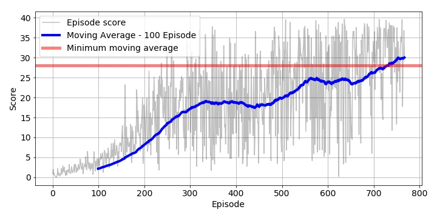

# Summary
This report is based on a DDPG algorithm for a continuous control task, whereby the goal is to teach a robot arm(with 2 d.o.f.) how to 
follow a randomly moving target. The final algorithm is based on the paper: [Continuous control with Deep RL](https://arxiv.org/pdf/1509.02971.pdf). The final algorithm that resulted in the following training graph was heavily based of the exercises within Udacity's Continuous Control section.

# Learning Algorithm
The main scripts employed are:
* ```ddpg_agent.py```:

    Contains the Experience Replay buffer, and Deep Q network logic. This has the hyper-parameters:
    1. BUFFER_SIZE = 1e5,
    2. BATCH_SIZE 128,
    3. GAMMA = 0.99,
    4. TAU=1e-3,
    5. LR_ACTOR = 2e-4,
    6. LR_CRITIC = 2e-4
    7. WEIGHT_DECAY = 0

* ```model.py```:

    1. Contains 2 similar small 3 layer MLPs using RELU activations (one for the Actor, the other the Critic).

    2. The last and second last layers are passed through a batch normalization.
    
    3. The first two layers make use of RELU activation functions.
    
    4. The last layers of these MLPs make use of TANH activation functions.

* ```Continuous_Control.ipynb```

    Stitches together all the moving parts and initiates the Agents training.

# Unique model architecture details
The DDPG Actor-critic model has the following unique architectural
## 1. Experience Replay
Each trajectory (s_t, a_t, r_t, s_t+1) gotten from interaction with the agent's environment is stored in a replay buffer. 
These transitions are then sampled from randomly during gradient updates of the DQN agent. 

This has a couple of advantages:
*   It Allows for smoothing the training distributions over past experiences, 
    by allowing each step to be sampled from multiple times
    during weight updates.
*   Sampling the environment results in strongly correlated samples caused by 
    time based environmental interactions. Randomly sampling these trajectories
    helps break this correlations.
*   Helps the agent get out poor action based feedback loops caused by falling into local minima. 
    This is done by getting an average over previous states and smoothing out learning and oscillations.

## 2. Epsilon Greedy
The DQN agent described above is Greedy in the limit with Infinite exploration (GLIE), as the epsilon greedy approach is used by annealing the epsilon function initially from 1.0, at a rate of 0.995 after each episode.

# Rewards Result
The agent achieves a score of roughly 13.0 after 500 episodes as evidence by the graph below:

# Ideas for Future Work
The number of episodes required to learn the task, can most likely be improved by further augmenting the 
DQN agent with some of the following architectural hacks.
- [Prioritized Experienced Replay](https://arxiv.org/abs/1511.05952):
This has the added advantage of allowing the model to prioritize certain experience tuples more often - rather than randomly sampling from out replay buffer. This could lead to faster more robust convergence.
- [Dueling Network Architecture](https://arxiv.org/pdf/1511.06581.pdf)
In order for the model to learn how best to evaluate a state in the Q-table, it must be able to estimate two primitives. Namely: given a state, the advantage of taking an action given that state A(s, a), and the state value V(s). This is represented by the equation:
```Q(s, a) = A(a, s)+V(s)``` This allows the model to decouple these two state aspects by redefining the training objective as a multi-class problem. I.e. we can learn what states are valuable, whilst separately learning what actions are valuable given such states.

# Trained model
The neural weights of the trained actor-critic agent can be found in the link below
[Trained model weights (DDPG)](./checkpoint_actor.pth)(./checkpoint_critic.pth)
